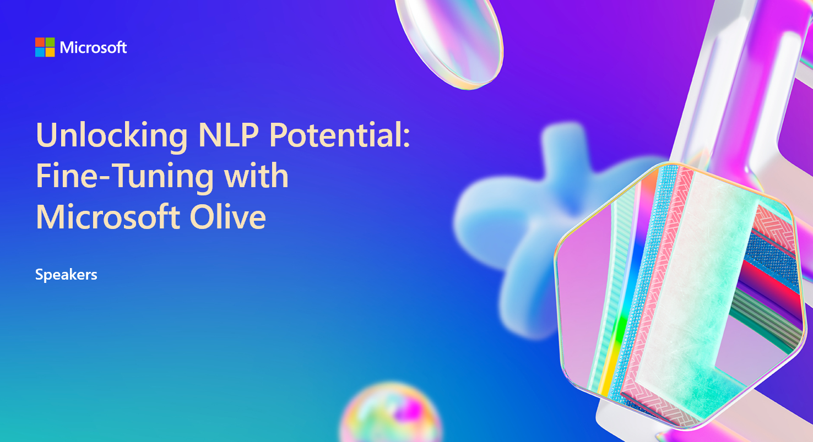

# Unlocking NLP Potential: Fine-Tuning with Microsoft Olive

## Fine-Tuning Workshop

This repository is for the Ignite 2024 PreDay Workshop on Fine Tuning Large Language Models

## Session Description

Abstract: Join us for an exclusive workshop on fine-tuning pre-trained language models using Microsoft Olive. Optimizes the fine-tuning process both in the cloud and locally. Deep dive into advanced techniques, gain hands-on experience, and practical insights to elevate your NLP projects. Achieve state-of-the-art performance and unlock new possibilities in NLP. Enhance your skills and stay ahead in the rapidly evolving field of NLP.

## Session Overview 

**1. Introduction and Overview (30 minutes)**
- Welcome and objectives
- Overview of Microsoft Olive
- Importance of fine-tuning in NLP

**2. Setting Up the Environment (45 minutes)**
- Introduction to Azure and Local GPU setups
- Step-by-step guide to configuring Azure for fine-tuning
- Setting up a local GPU environment

**3. Fine-Tuning Basics (45 minutes)**
- Understanding pre-trained models
- Introduction to fine-tuning techniques
- Hands-on exercise: Fine-tuning a simple model

**4. Advanced Fine-Tuning Techniques (45 minutes)**
- Hyperparameter tuning
- Data augmentation strategies
- Hands-on exercise: Implementing advanced techniques

**5. Optimizing Performance (30 minutes)**
- Monitoring and evaluating model performance
- Using Microsoft Olive for optimization
- Hands-on exercise: Performance tuning

**6. Deploying Fine-Tuned Models (30 minutes)**
- Deployment strategies on Azure
- Local deployment considerations
- Hands-on exercise: Deploying a model

**7. Consumption of the Model (15 minutes)**
- Using .NET Aspire Application to consumed the fine tuned model
- Optimize the model for specific hardware

**8. Q&A and Wrap-Up (15 minutes)**
- Open floor for questions
- Recap of key takeaways
- Next steps and additional resources

### Duration
4 hours

### [Slide Deck](https://..)

## Learning Outcomes
* Understand how to fine tune Language Models
* Create synethic data 
* Fine-Tuning techniques and best practices​

## Technology Used
* Azure AI Studio
* Azure ML Studio 
* AI Toolkit 
* Microsoft Olive
* Microsoft ONNX Runtime

## Additional Resources and Continued Learning

| Resources          | Links                             | Description        |
|:-------------------|:----------------------------------|:-------------------|
| Session Slides | [View](https://aka.ms/..) | Review the slides presented during the workshop at your own pace |

## Content Owners
<!-- TODO: Add yourself as a content owner
1. Change the src in the image tag to {your github url}.png
2. Change INSERT NAME HERE to your name
3. Change the github url in the final href to your url. -->

<table>
<tr>
    <td align="center"><a href="http://learnanalytics.microsoft.com">
         
        <b> Lee Stott
</b></a> 
            <a href="https://github.com/leestott" title="talk">📢</a> 
    </td>
    <td align="center"><a href="http://learnanalytics.microsoft.com">
         
        <b>Kinfey Lo
</b></a> 
</td>
    <td align="center"><a href="http://learnanalytics.microsoft.com">
         
        <b>Sam Kemp
</b></a> 
            <a href="https://github.com/bethanyjep" title="talk">📢</a> 
    </td>
</tr></table>

## Responsible AI 

Microsoft is committed to helping our customers use our AI products responsibly, sharing our learnings, and building trust-based partnerships through tools like Transparency Notes and Impact Assessments. Many of these resources can be found at [https://aka.ms/RAI](https://aka.ms/RAI).
Microsoft’s approach to responsible AI is grounded in our AI principles of fairness, reliability and safety, privacy and security, inclusiveness, transparency, and accountability.

Large-scale natural language, image, and speech models - like the ones used in this sample - can potentially behave in ways that are unfair, unreliable, or offensive, in turn causing harms. Please consult the [Azure OpenAI service Transparency note](https://learn.microsoft.com/legal/cognitive-services/openai/transparency-note?tabs=text) to be informed about risks and limitations.

The recommended approach to mitigating these risks is to include a safety system in your architecture that can detect and prevent harmful behavior. [Azure AI Content Safety](https://learn.microsoft.com/azure/ai-services/content-safety/overview) provides an independent layer of protection, able to detect harmful user-generated and AI-generated content in applications and services. Azure AI Content Safety includes text and image APIs that allow you to detect material that is harmful. We also have an interactive Content Safety Studio that allows you to view, explore and try out sample code for detecting harmful content across different modalities. The following [quickstart documentation](https://learn.microsoft.com/azure/ai-services/content-safety/quickstart-text?tabs=visual-studio%2Clinux&pivots=programming-language-rest) guides you through making requests to the service.

Another aspect to take into account is the overall application performance. With multi-modal and multi-models applications, we consider performance to mean that the system performs as you and your users expect, including not generating harmful outputs. It's important to assess the performance of your overall application using [generation quality and risk and safety metrics](https://learn.microsoft.com/azure/ai-studio/concepts/evaluation-metrics-built-in).

You can evaluate your AI application in your development environment using the [prompt flow SDK](https://microsoft.github.io/promptflow/index.html). Given either a test dataset or a target, your generative AI application generations are quantitatively measured with built-in evaluators or custom evaluators of your choice. To get started with the prompt flow sdk to evaluate your system, you can follow the [quickstart guide](https://learn.microsoft.com/azure/ai-studio/how-to/develop/flow-evaluate-sdk). Once you execute an evaluation run, you can [visualize the results in Azure AI Studio](https://learn.microsoft.com/azure/ai-studio/how-to/evaluate-flow-results).

