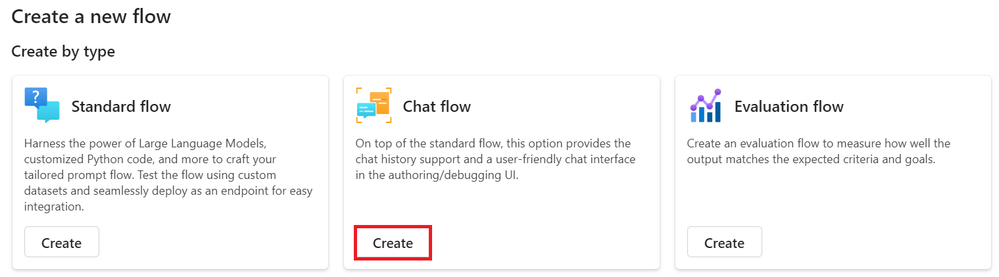

# Introduction

> [!NOTE]
>This is a **10-minute** workshop that will give you a hands-on introduction to the core concepts of using a AI Studio to consuming a deployed model endpoint.

## Learning Objectives

After successfully deploying your fine-tuned model, you can now integrate it with Prompt flow to use your model in real-time applications, enabling a variety of interactive tasks with your custom Phi-3 model.

By the end of this workshop, you should be able to:
1. Integrate the custom Phi-3 model with Prompt flow using Azure AI Studio.
1. Test your custom Phi-3 model on Prompt flow.

## Lab Scenario
This lab scenario comprimises of the following:
- Create Azure AI Studio Hub.
- Create Azure AI Studio Project.
- Create Prompt flow.
- Add a custom connection for the fine-tuned Phi-3 model.
- Set up Prompt flow to chat with your custom Phi-3 model

## Lab Outline
This lab includes the following exercises:
1. Integrate the custom Phi-3 model with Prompt flow
1. Test your custom Phi-3 model on Prompt flow

### Integrate the custom Phi-3 model with Prompt flow


> [!NOTE]
>You can also integrate with Prompt flow using Azure ML Studio. The same integration process can be applied to Azure ML Studio.

 
### Create Azure AI Studio Hub
 

You need to create a Hub before creating the Project. A Hub acts like a Resource Group, allowing you to organize and manage multiple Projects within Azure AI Studio.

- Visit [Azure AI Studio](http://ai.azure.com).

- Select All hubs from the left side tab.

- Select + New hub from the navigation menu.


- Perform the following tasks:

- Enter Hub name. It must be a unique value.
- Select your Azure Subscription.
- Select the Resource group to use (create a new one if needed).
- Select the Location you'd like to use.
- Select the Connect Azure AI Services to use (create a new one if needed).
- Select Connect Azure AI Search to Skip connecting.


- Select Next.

### Create Azure AI Studio Project
 

In the Hub that you created, select All projects from the left side tab.

- Select + New project from the navigation menu.
	

- Enter Project name. It must be a unique value.


- Select Create a project.

### Add a custom connection for the fine-tuned Phi-3 model

To integrate your custom Phi-3 model with Prompt flow, you need to save the model's endpoint and key in a custom connection. This setup ensures access to your custom Phi-3 model in Prompt flow.

### Set api key and endpoint uri of the fine-tuned Phi-3 model

- Visit [Azure ML Studio](https://ml.azure.com).

- Navigate to the Azure Machine learning workspace that you created.

- Select Endpoints from the left side tab.


- Select endpoint that you created.


- Select Consume from the navigation menu.

- Copy your REST endpoint and Primary key.

	

- Add the Custom Connection
- Visit [Azure AI Studio](https://ai.azure.com).

- Navigate to the Azure AI Studio project that you created.

- In the Project that you created, select Settings from the left side tab.

- Select + New connection.


- Select Custom keys from the navigation menu.


Perform the following tasks:

- Select + Add key value pairs.
For the key name, enter endpoint and paste the endpoint you copied from Azure ML Studio into the value field.
- Select + Add key value pairs again.
For the key name, enter key and paste the key you copied from Azure ML Studio into the value field.
- After adding the keys, select is secret to prevent the key from being exposed.


- Select Add connection.

- Perform the following tasks to add the custom Phi-3 model's key:

### Create Prompt flow

You have added a custom connection in Azure AI Studio. Now, let's create a Prompt flow using the following steps. Then, you will connect this Prompt flow to the custom connection so that you can use the fine-tuned model within the Prompt flow.

- Navigate to the Azure AI Studio project that you created.

- Select Prompt flow from the left side tab.

- Select + Create from the navigation menu.

 
- Select Chat flow from the navigation menu.



- Enter Folder name to use.


- Select Create.


### Set up Prompt flow to chat with your custom Phi-3 model

You need to integrate the fine-tuned Phi-3 model into a Prompt flow. However, the existing Prompt flow provided is not designed for this purpose. Therefore, you must redesign the Prompt flow to enable the integration of the custom model.

In the Prompt flow, perform the following tasks to rebuild the existing flow:

- Select Raw file mode.

- Delete all existing code in the `flow.dag.yaml` file.

Add the following code to flow.`dag.yaml` file.

```
inputs:
  input_data:
    type: string
    default: "Who founded Microsoft?"

outputs:
  answer:
    type: string
    reference: ${integrate_with_promptflow.output}

nodes:
- name: integrate_with_promptflow
  type: python
  source:
    type: code
    path: integrate_with_promptflow.py
  inputs:
    input_data: ${inputs.input_data}

```

- Select Save.


- Add the following code to `integrate_with_promptflow.py`  file to use the custom Phi-3 model in Prompt flow.

```
import logging
import requests
from promptflow import tool
from promptflow.connections import CustomConnection

# Logging setup
logging.basicConfig(
    format="%(asctime)s - %(levelname)s - %(name)s - %(message)s",
    datefmt="%Y-%m-%d %H:%M:%S",
    level=logging.DEBUG
)
logger = logging.getLogger(__name__)

def query_phi3_model(input_data: str, connection: CustomConnection) -> str:
    """
    Send a request to the Phi-3 model endpoint with the given input data using Custom Connection.
    """

    # "connection" is the name of the Custom Connection, "endpoint", "key" are the keys in the Custom Connection
    endpoint_url = connection.endpoint
    api_key = connection.key

    headers = {
        "Content-Type": "application/json",
        "Authorization": f"Bearer {api_key}"
    }
    data = {
        "input_data": {
            "input_string": [
                {"role": "user", "content": input_data}
            ],
            "parameters": {
                "temperature": 0.7,
                "max_new_tokens": 128
            }
        }
    }
    try:
        response = requests.post(endpoint_url, json=data, headers=headers)
        response.raise_for_status()
        
        # Log the full JSON response
        logger.debug(f"Full JSON response: {response.json()}")

        result = response.json()["output"]
        logger.info("Successfully received response from Azure ML Endpoint.")
        return result
    except requests.exceptions.RequestException as e:
        logger.error(f"Error querying Azure ML Endpoint: {e}")
        raise

@tool
def my_python_tool(input_data: str, connection: CustomConnection) -> str:
    """
    Tool function to process input data and query the Phi-3 model.
    """
    return query_phi3_model(input_data, connection)
```


> [!NOTE]
>For more detailed information on using Prompt flow in Azure AI Studio, you can refer to Prompt flow in Azure AI Studio.

- Select Chat input, Chat output to enable chat with your model.


Now you are ready to chat with your custom Phi-3 model. In the next exercise, you will learn how to start Prompt flow and use it to chat with your fine-tuned Phi-3 model.

> [!NOTE]
>The rebuilt flow should look like the image below:


## Chat with your custom Phi-3 model

Now that you have fine-tuned and integrated your custom Phi-3 model with Prompt flow, you are ready to start interacting with it. This exercise will guide you through the process of setting up and initiating a chat with your model using Prompt flow. By following these steps, you will be able to fully utilize the capabilities of your fine-tuned Phi-3 model for various tasks and conversations.

### Start Prompt flow

-Select Start compute sessions to start Prompt flow.


- Select Validate and parse input to renew parameters.


- Select the Value of the connection to the custom connection you created. For example, connection.


### Chat with your custom Phi-3 model
 

- Select Chat.


Here's an example of the results: Now you can chat with your custom Phi-3 model. It is recommended to ask questions based on the data used for fine-tuning.


