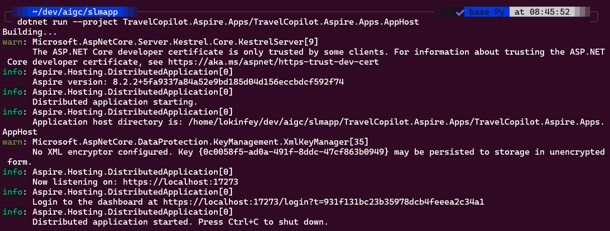
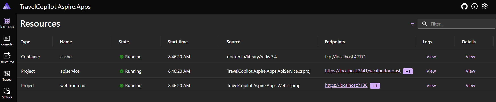
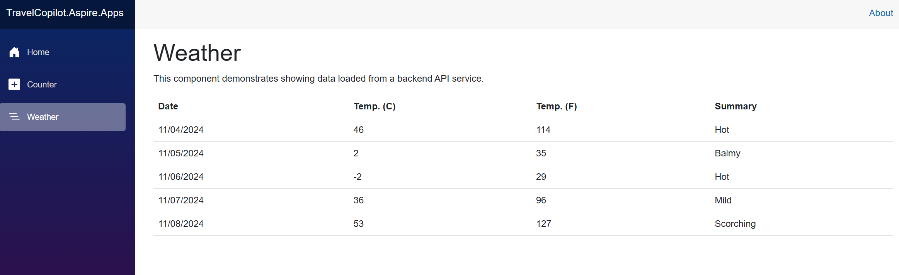

# Introduction .NET Aspire
> [!NOTE]
>This is a **30-minute** workshop that will give you a hands-on introduction to the core concepts for .NET Aspire

## Learning Objectives


By the end of this workshop, you should be able to:
1. Know basic knowledge of .NET Aspire   
2. Create .NET Aspire Application With .NET

### What's .NET Aspire

.NET Aspire is an opinionated, cloud ready stack for building observable, production ready, distributed applications.​ .NET Aspire is delivered through a collection of NuGet packages that handle specific cloud-native concerns. Cloud-native apps often consist of small, interconnected pieces or microservices rather than a single, monolithic code base. Cloud-native apps generally consume a large number of services, such as databases, messaging, and caching.

A distributed application is one that uses computational resources across multiple nodes, such as containers running on different hosts. Such nodes must communicate over network boundaries to deliver responses to users. A cloud-native app is a specific type of distributed app that takes full advantage of the scalability, resilience, and manageability of cloud infrastructures.

### Why .NET Aspire?

.NET Aspire is designed to improve the experience of building .NET cloud-native apps. It provides a consistent, opinionated set of tools and patterns that help you build and run distributed apps. .NET Aspire is designed to help you with:

   - **Orchestration**: .NET Aspire provides features for running and connecting multi-project applications and their dependencies for local development environments.
   - **Integrations**: .NET Aspire integrations are NuGet packages for commonly used services, such as Redis or Postgres, with standardized interfaces ensuring they connect consistently and seamlessly with your app.
   - **Tooling**: .NET Aspire comes with project templates and tooling experiences for Visual Studio, Visual Studio Code, and the .NET CLI to help you create and interact with .NET Aspire projects.

### Set up .NET Aspire env

1. Install .NET 8 SDK in lab env


```bash

sudo apt-get update && \
  sudo apt-get install -y dotnet-sdk-8.0

```


2. Using dotnet workload to install .NET Aspire SDK

```bash

dotnet workload update

dotnet workload install aspire

```

3. Install Docker SDK


```bash

sudo apt update

sudo apt install apt-transport-https ca-certificates curl software-properties-common

curl -fsSL https://download.docker.com/linux/ubuntu/gpg | sudo gpg --dearmor -o /usr/share/keyrings/docker-archive-keyring.gpg

echo "deb [arch=$(dpkg --print-architecture) signed-by=/usr/share/keyrings/docker-archive-keyring.gpg] https://download.docker.com/linux/ubuntu $(lsb_release -cs) stable" | sudo tee /etc/apt/sources.list.d/docker.list > /dev/null

sudo apt update

apt-cache policy docker-ce

sudo apt install docker-ce

```

start Docker servce

```bash

sudo systemctl status docker

```

Executing the Docker Command Without Sudo


```bash

sudo usermod -aG docker ${USER}

su - ${USER}

sudo usermod -aG docker username

```


### Build your first .NET Aspire solution with CLI


You need to trust the ASP.NET Core localhost certificate before running the app. Run the following command

```bash

dotnet dev-certs https --trust

dotnet new aspire-starter --use-redis-cache --output TravelCopilot.Aspire.Apps

```

Running TravelCopilot.Aspire.Apps


```bash

dotnet run --project TravelCopilot.Aspire.Apps/TravelCopilot.Aspire.Apps.AppHost

```

Go to the portal - the link like this  [https://localhost:17273/login?t=931f131bc23b35978dcb4feeea2c34a1]( https://localhost:17273/login?t=931f131bc23b35978dcb4feeea2c34a1) in command line 



.NET Aspire Portal 



Click webfrontend link , you can go to Weather , you can see



In this exercise, you learn how to create a .NET Aspire Application.


