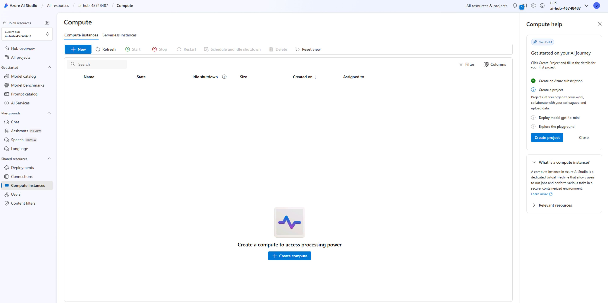

# Open yourAI Hub and Project in the Azure AI Portal

You start by creating an Azure AI project within an Azure AI hub:

1. In a web browser, open +++https://ai.azure.com+++ and sign in using your Azure credentials.
1. Select the **Home** 
1. You should a valid **curent project** and **Hub**

# Create your Cloud Compute Resources for Cloud based inference

1. Under **Settings**, **Compute**, select **Create Compute**.

  

1. Select your **Virtual machine type** as **GPU**. *Filter* the list of **Virtual machine size** on **A100**: 
    
  
    
    Select a VM Stanard NC24ads_A100v4

1. Select **Review+Create** and then **Create**