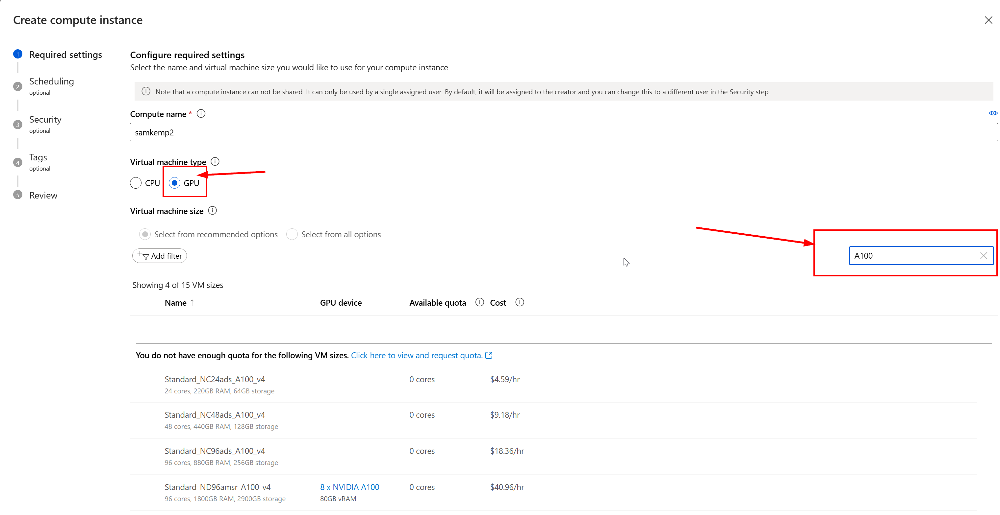

# Optimize AI models for on-device inference

> [!IMPORTANT]
> This lab requires an **Nvidia A10 or A100 GPU** with associated drivers and CUDA toolkit (version 12+) installed.

> [!NOTE]
> This is a **30-minute** lab that will give you a hands-on introduction to the core concepts of optimizing models for on-device inference using OLIVE.

## Learning Objectives

By the end of this lab, you will be able to use OLIVE to:

- Quantize an AI Model using the AWQ quantization method.
- Fine-tune an AI model for a specific task.
- Generate LoRA adapters (fine-tuned model) for efficient on-device inference on the ONNX Runtime.

### What is OLIVE

OLIVE (ONNX LIVE) is a model optimization toolkit with accompanying CLI that enables you to ship models for the [ONNX runtime](https://onnxruntime.ai) with quality and performance.


The input to OLIVE is typically a PyTorch or Hugging Face model and the output is an optimized ONNX model that is executed on a device (deployment target) running the ONNX runtime. OLIVE will optimize the model for the deployment target's AI accelerator (NPU, GPU, CPU) provided by a hardware vendor such as Qualcomm, AMD, Nvidia or Intel.

OLIVE executes a *workflow*, which is an ordered sequence of individual model optimization tasks called *passes* - example passes include: model compression, graph capture, quantization, graph optimization. Each pass has a set of parameters that can be tuned to achieve the best metrics, say accuracy and latency, that are evaluated by the respective evaluator. OLIVE employs a search strategy that uses a search algorithm to auto-tune each pass one by one or set of passes together.

#### Benefits of OLIVE

- **Reduce frustration and time** of trial-and-error manual experimentation with different techniquies for graph optimization, compression and quantization. Define your quality and performance constraints and let OLIVE automatically find the best model for you.
- **40+ built-in model optimization components** covering cutting edge techniques in quantization, compression, graph optimization and finetuning.
- **Easy-to-use CLI** for common model optimization tasks. For example, olive quantize, olive auto-opt, olive finetune.
- Model packaging and deployment built-in.
- Supports generating models for **Multi LoRA serving**.
- Construct workflows using YAML/JSON to orchestrate model optimization and deployment tasks.
- **Hugging Face** and **Azure AI** Integration.
- Built-in **caching** mechanism to **save costs**.

## Lab Instructions

### Step 1: Create Azure AI Compute
You'll need the following an Azure AI Compute Instance, which can be created using the following steps:

1. Sign in to [Azure AI Studio](https://ai.azure.com) and select your project. If you don't have a project already, first create one 

### Step 2. Creating a Hub and Project 

To create a project in Azure AI Studio, follow these steps:

Go to the Home page of [Azure AI Studio](https://ai.azure.com).

Select + New project.

Enter a name for the project.

Select a hub from the dropdown to host your project. For information about the relationship between hubs and projects, see the hubs and projects overview documentation. If you don't yet have a hub, select Create a new hub.


**Note:** To create a hub, you must have Owner or Contributor permissions on the selected resource group. It's recommended to share a hub with your team. This lets you share configurations like data connections with all projects, and centrally manage security settings and spend. For more options to create a hub, see how to create and manage an Azure AI Studio hub. A project name must be unique between projects that share the same hub.

If you're creating a new hub, enter a name.

Select your Azure subscription from the Subscription dropdown. Choose a specific Azure subscription for your project for billing, access, or administrative reasons. For example, this grants users and service principals with subscription-level access to your project.

Leave the Resource group as the default to create a new resource group. Alternatively, you can select an existing resource group from the dropdown.

**Tip:** Especially for getting started it's recommended to create a new resource group for your project. This allows you to easily manage the project and all of its resources together. When you create a project, several resources are created in the resource group, including a hub, a container registry, and a storage account.

Enter the Location for the hub and then select Next. The location is the region where the hub is hosted. The location of the hub is also the location of the project. Azure AI services availability differs per region. For example, certain models might not be available in certain regions.

Select an existing Azure AI services resource (including Azure OpenAI) from the dropdown or create a new one.


On the Review and finish page, you see the Azure AI services resource name and other settings to review.


Review the project details and then select Create a project. You see progress of resource creation and the project is created when the process is complete.


Once a project is created, you can access the playground, tools, and other assets in the left navigation panel.


On the project Settings page you can find information about the project, such as the project name, description, and the hub that hosts the project. You can also find the project ID, which is used to identify the project via SDK or API.


Name: The name of the project corresponds to the selected project in the left panel.
Hub: The hub that hosts the project.
Location: The location of the hub that hosts the project. For supported locations, see Azure AI Studio regions.
Subscription: The subscription that hosts the hub that hosts the project.
Resource group: The resource group that hosts the hub that hosts the project.
Select Manage in the Azure portal to navigate to the project resources in the Azure portal.

### Access project resources

1. Under **Settings**, select **Create compute**.

    

1. Select your **Virtual machine type** as **GPU**. *Filter* the list of **Virtual machine size** on **A100**: 
    
    
    
    Select a VM you have available quota for.

1. Select **Review+Create** and then **Create**.

### Step 2: Clone this repo

On your Azure AI Compute Instance, run the following commands in a terminal window. In VS Code, you can open a new terminal with **Ctrl+j**.

```bash
cd ~/cloudfiles
git clone https://github.com/Azure/Ignite_FineTuning_workshop.git
```

### Step 3: Open Folder in VS Code

In your Azure AI VS Code, open the clone repo folder by selecting **File** > **Open Folder**.

Choose the following path: `lab/workshop-instructions/lab5-optimize-model`

### Step 4: Install dependencies

Open a terminal window in VS Code in your Azure AI Compute Instance (tip: **Ctrl+j**) and execute:

```bash
conda create -n -y olive-ai python=3.11
conda activate olive-ai
pip install -r requirements.txt
sudo apt-get -y install cudnn9-cuda-12
```

### Step 5: Execute OLIVE commands 

#### Option A: Execute commands in Notebook

If you prefer to use Jupyter, you can open the `olive-optimization.ipynb` and follow the instructions contained in the Python Notebook.

#### Option B: Execute commands from the command line

Open a terminal window in VS Code in your Azure AI Compute Instance (tip: **Ctrl+j**) and activate the `olive-ai` conda environment:

```bash
conda activate olive-ai
```

Next, execute the following scripts...

1. Execute [Active Aware Quantization (AWQ)](https://arxiv.org/abs/2306.00978) using:
    
    ```bash
    ./scripts/01-quantize.sh
    ```
    
    It takes **~10mins** to complete the AWQ quantization.

1. Fine-tune the quantized model using:
    
    ```bash
    ./scripts/02-finetune.sh
    ```
    
    It takes **~10mins** to complete the Fine-tuning (depending on the number of epochs).

1. Capture the ONNX Graph - this will save the model weights into ONNX format and capture the Neural Network graph (so that it can run on the ONNX Runtime):
    
    ```bash
    ./scripts/03-capture-onnx-graph.sh
    ```
    
    It takes **~10mins** to complete the Fine-tuning (depending on the number of epochs).

1. Generate adapters - this will mutate the base model so that it can accept adapters:
    
    ```bash
    ./scripts/04-gen-adapters.sh
    ```
    
    It takes **~2mins** to complete the adapter extraction and ONNX optimization.