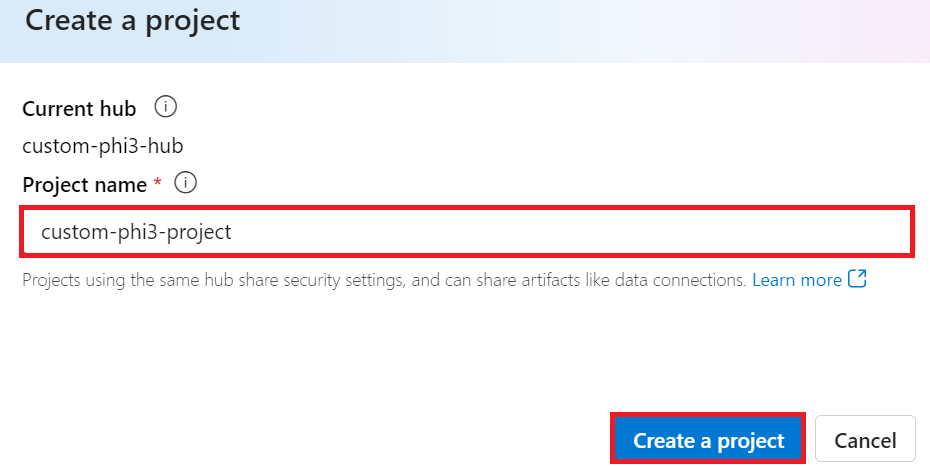
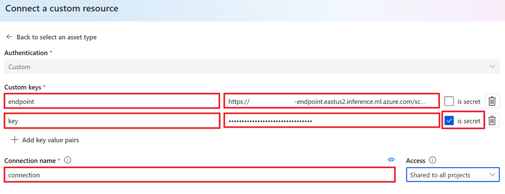
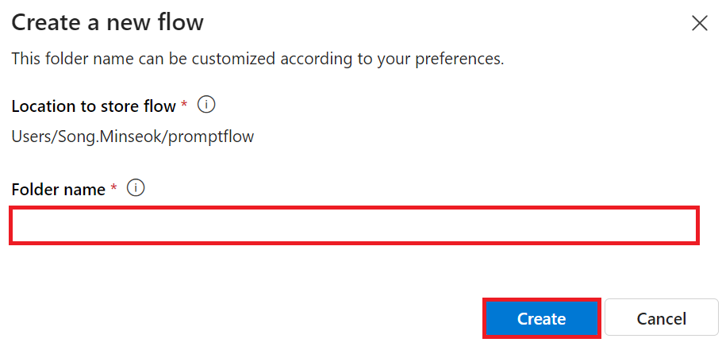
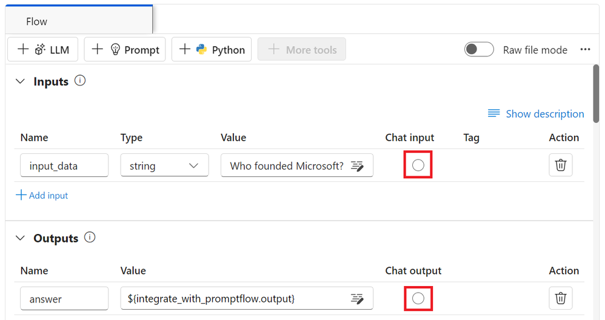
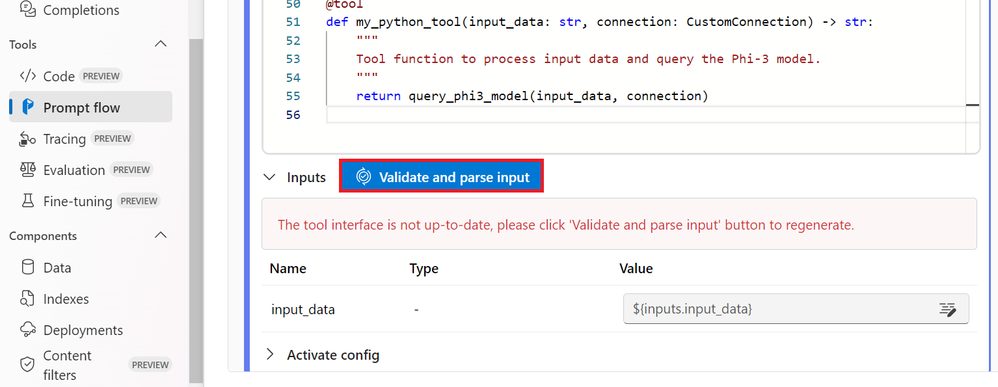
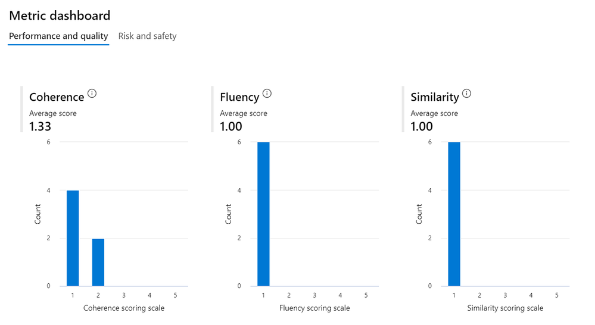

# Lab 6. Evaluate your AI Model 

## Introduction

> [!NOTE]
>This is a **35-minute** workshop that will give you a hands-on introduction Fine-tuning a model can sometimes lead to unintended or undesired responses. To ensure that the model remains safe and effective, it's important to evaluate it. This evaluation helps to assess the model's potential to generate harmful content and its ability to produce accurate, relevant, and coherent responses.

## Learning Objectives

You will learn how to evaluate the safety and performance of a fine-tuned Phi-3 / Phi-3.5 model integrated with Prompt flow in Azure AI Studio.

## Lab Scenario
Introduction to Azure AI Studio's Prompt flow evaluation
- Introduction to safety evaluation
- Introduction to performance evaluation

## Lab Outline


### Introduction to Azure AI Studio's Prompt flow evaluation

To ensure that your AI model is ethical and safe, it's crucial to evaluate it against Microsoft's Responsible AI Principles. In Azure AI Studio, safety evaluations allow you to evaluate an your model’s vulnerability to jailbreak attacks and its potential to generate harmful content, which is directly aligned with these principles.

### Microsoft’s Responsible AI Principles

	
  
Before beginning the technical steps, it's essential to understand Microsoft's Responsible AI Principles, an ethical framework designed to guide the responsible development, deployment, and operation of AI systems. These principles guide the responsible design, development, and deployment of AI systems, ensuring that AI technologies are built in a way that is fair, transparent, and inclusive. These principles are the foundation for evaluating the safety of AI models.

#### Microsoft's Responsible AI Principles include:

Fairness and Inclusiveness: AI systems should treat everyone fairly and avoid affecting similarly situated groups of people in different ways. For example, when AI systems provide guidance on medical treatment, loan applications, or employment, they should make the same recommendations to everyone who has similar symptoms, financial circumstances, or professional qualifications.

Reliability and Safety: To build trust, it's critical that AI systems operate reliably, safely, and consistently. These systems should be able to operate as they were originally designed, respond safely to unanticipated conditions, and resist harmful manipulation. How they behave and the variety of conditions they can handle reflect the range of situations and circumstances that developers anticipated during design and testing.

Transparency: When AI systems help inform decisions that have tremendous impacts on people's lives, it's critical that people understand how those decisions were made. For example, a bank might use an AI system to decide whether a person is creditworthy. A company might use an AI system to determine the most qualified candidates to hire.

Privacy and Security: As AI becomes more prevalent, protecting privacy and securing personal and business information are becoming more important and complex. With AI, privacy and data security require close attention because access to data is essential for AI systems to make accurate and informed predictions and decisions about people.

Accountability: The people who design and deploy AI systems must be accountable for how their systems operate. Organizations should draw upon industry standards to develop accountability norms. These norms can ensure that AI systems aren't the final authority on any decision that affects people's lives. They can also ensure that humans maintain meaningful control over otherwise highly autonomous AI systems.


> [!NOTE]
>To learn more about Microsoft's Responsible AI Principles, visit the What is Responsible AI?.

 
### Safety metrics
 

In this lab, you will evaluate the safety of the fine-tuned Phi-3 / Phi-3.5 model using Azure AI Studio's safety metrics. These metrics help you assess the model's potential to generate harmful content and its vulnerability to jailbreak attacks. The safety metrics include:

 
-Self-harm-related Content: Evaluates whether the model has a tendency to produce self-harm related content.
- Hateful and Unfair Content: Evaluates whether the model has a tendency to produce hateful or unfair content.
- Violent Content: Evaluates whether the model has a tendency to produce violent content.
- Sexual Content: Evaluates whether the model has a tendency to produce inappropriate sexual content.
 

Evaluating these aspects ensures that the AI model does not produce harmful or offensive content, aligning it with societal values and regulatory standards.

	

### Introduction to performance evaluation

To ensure that your AI model is performing as expected, it's important to evaluate its performance against performance metrics. In Azure AI Studio, performance evaluations allow you to evaluate your model's effectiveness in generating accurate, relevant, and coherent responses.


### Performance metrics
 
In this lab, you will evaluate the performance of the fine-tuned Phi-3 / Phi-3.5 model using Azure AI Studio's performance metrics. These metrics help you assess the model's effectiveness in generating accurate, relevant, and coherent responses. The performance metrics include:

- Groundedness: Evaluate how well the generated answers align with the information from the input source.
- Relevance: Evaluates the pertinence of generated responses to the given questions.
- Coherence: Evaluate how smoothly the generated text flows, reads naturally, and resembles human-like language.
- Fluency: Evaluate the language proficiency of the generated text.
- GPT Similarity: Compares the generated response with the ground truth for similarity.
- F1 Score: Calculates the ratio of shared words between the generated response and the source data.
 

These metrics help you evaluate the model's effectiveness in generating accurate, relevant, and coherent responses.


## Evaluating the model in Azure AI Studio
 
In this lab, you will deploy an model as an evaluator in Azure AI Studio and use it to evaluate your fine-tuned model.

Before you begin this tutorial, make sure you have the following prerequisites, as described in the previous tutorials:

- A prepared dataset to evaluate the fine-tuned model.
- A model that has been fine-tuned and deployed
- A Prompt flow integrated with your fine-tuned model in Azure AI Studio.

> [!NOTE]
>You will use the test_data.jsonl file, located in the data folder from the ULTRACHAT_200k dataset downloaded in the previous blog posts, as the dataset to evaluate the fine-tuned model.

 

## Manually evaluate a language model in the Azure AI Studio

You can manually review model responses based on test data. Manually reviewing allows you to test different inputs one at a time to evaluate whether the model performs as expected.

1. In the **Chat playground**, select the **Evaluate**  dropdown from the top bar, and select **Manual evaluation**.
1. Change the **System message** to the same message as you used above (included here again):

   ```
   **Objective**: Assist users with travel-related inquiries, offering tips, advice, and recommendations as a knowledgeable travel agent.

   **Capabilities**:
   - Provide up-to-date travel information, including destinations, accommodations, transportation, and local attractions.
   - Offer personalized travel suggestions based on user preferences, budget, and travel dates.
   - Share tips on packing, safety, and navigating travel disruptions.
   - Help with itinerary planning, including optimal routes and must-see landmarks.
   - Answer common travel questions and provide solutions to potential travel issues.
    
   **Instructions**:
   1. Engage with the user in a friendly and professional manner, as a travel agent would.
   2. Use available resources to provide accurate and relevant travel information.
   3. Tailor responses to the user's specific travel needs and interests.
   4. Ensure recommendations are practical and consider the user's safety and comfort.
   5. Encourage the user to ask follow-up questions for further assistance.
   ```

1. In the **Manual evaluation result** section, you'll add five inputs for which you will review the output. Enter the following five questions as five separate **Inputs**:

   `Can you provide a list of the top-rated budget hotels in Rome?`

   `I'm looking for a vegan-friendly restaurant in New York City. Can you help?`

   `Can you suggest a 7-day itinerary for a family vacation in Orlando, Florida?`

   `Can you help me plan a surprise honeymoon trip to the Maldives?`

   `Are there any guided tours available for the Great Wall of China?`

1. Select **Run** from the top bar to generate outputs for all questions you added as inputs.
1. You can now manually review the outputs for each question by selecting the thumbs up or down icon at the bottom right of a response. Rate each response, ensuring you include at least one thumbs up and one thumbs down response in your ratings.
1. Select **Save results** from the top bar. Enter `manual_evaluation_results` as the name for the results.
1. Using the menu on the left, navigate to **Evaluation**.
1. Select the **Manual evaluations** tab to find the manual evaluations you just saved. Note that you can explore your previously created manual evaluations, continue where you left of, and save the updated evaluations.

## Evaluate your with built-in metrics

When you have created a copilot with a chat flow, you can evaluate the flow by doing a batch run and assessing the performance of the flow with built-in metrics.

1. Select the **Automated evaluations** tab and create a **New evaluation** with the following settings:
    <details>  
      <summary><b>Troubleshooting tip</b>: Permissions error</summary>
        <p>If you receive a permissions error when you create a new prompt flow, try the following to troubleshoot:</p>
        <ul>
          <li>In the Azure portal, select the AI Services resource.</li>
          <li>On the Identity tab under Resource Management, confirm that it is system assigned managed identity.</li>
          <li>Navigate to the associated Storage Account. On the IAM page, add role assignment <em>Storage blob data reader</em>.</li>
          <li>Under <strong>Assign access to</strong>, choose <strong>Managed Identity</strong>, <strong>+ Select members</strong>, and select the <strong>All system-assigned managed identities</strong>.</li>
          <li>Review and assign to save the new settings and retry the previous step.</li>
        </ul>
    </details>

    - **What do you want to evaluate?**: Dataset
    - **Evaluation name**: *Enter a unique name*
    - **What kind of scenario are you evaluating?**: Question and answer without context
    - Select **Next**
    - **Select the data you want to evaluate**: Add your dataset
        - Download the https://raw.githubusercontent.com/MicrosoftLearning/mslearn-ai-studio/main/data/travel-qa.jsonl JSONL file and upload it to the UI.
    - **Select metrics**: Coherence, Fluency
    - **Connection**: *Your AI Services connection*
    - **Deployment name/Model**: *Your deployed GPT-3.5 model*
1. Select **Next** then review your data and submit the new evaluation.
1. Wait for the evaluations to be completed, you may need to refresh.
1. Select the evaluation run you just created.
1. Explore the **Metric dashboard** and **Detailed metrics result**.

## Integrate the custom model with Prompt flow in Azure AI Studio(Code first approach)
 
### Create Azure AI Studio Hub

You need to create a Hub before creating the Project. A Hub acts like a Resource Group, allowing you to organize and manage multiple Projects within Azure AI Studio.

- Sign in [Azure AI Studio](https://ai.azure.com).

- Select All hubs from the left side tab.

- Select + New hub from the navigation menu.


Perform the following tasks:

- Enter Hub name. It must be a unique value.
- Select your Azure Subscription.
- Select the Resource group to use (create a new one if needed).
- Select the Location you'd like to use.
- Select the Connect Azure AI Services to use (create a new one if needed).
- Select Connect Azure AI Search to Skip connecting.


- Select Next.

### Create Azure AI Studio Project
 
In the Hub that you created, select All projects from the left side tab.

- Select + New project from the navigation menu.


- Enter Project name. It must be a unique value.


- Select Create a project.

### Add a custom connection for the fine-tuned Phi-3 / Phi-3.5 model

To integrate your custom Phi-3 / Phi-3.5 model with Prompt flow, you need to save the model's endpoint and key in a custom connection. This setup ensures access to your custom Phi-3 / Phi-3.5 model in Prompt flow.

- Set api key and endpoint uri of the fine-tuned Phi-3 / Phi-3.5 model

- Visit [Azure ML Studio](https://ml.azure.com).

- Navigate to the Azure Machine learning workspace that you created.

- Select Endpoints from the left side tab.

 

- Select endpoint that you created.


- Select Consume from the navigation menu.

- Copy your REST endpoint and Primary key.


- Add the Custom Connection

- Visit [Azure AI Studio](https://ai.azure.com).

- Navigate to the Azure AI Studio project that you created.

- In the Project that you created, select Settings from the left side tab.

- Select + New connection.


- Select Custom keys from the navigation menu.


Perform the following tasks:

- Select + Add key value pairs.
For the key name, enter endpoint and paste the endpoint you copied from Azure ML Studio into the value field.
- Select + Add key value pairs again.
For the key name, enter key and paste the key you copied from Azure ML Studio into the value field.
- After adding the keys, select is secret to prevent the key from being exposed.



- Select Add connection.

### Create Prompt flow

You have added a custom connection in Azure AI Studio. Now, let's create a Prompt flow using the following steps. Then, you will connect this Prompt flow to the custom connection to use the fine-tuned model within the Prompt flow.

- Navigate to the Azure AI Studio project that you created.

- Select Prompt flow from the left side tab.

- Select + Create from the navigation menu.


- Select Chat flow from the navigation menu.


- Enter Folder name to use.


- Select Create.

### Set up Prompt flow to chat with your custom model
 You need to integrate the fine-tuned model into a Prompt flow. However, the existing Prompt flow provided is not designed for this purpose. Therefore, you must redesign the Prompt flow to enable the integration of the custom model.

In the Prompt flow, perform the following tasks to rebuild the existing flow:

- Select Raw file mode.

- Delete all existing code in the `flow.dag.yml` file.

Add the folling code to `flow.dag.yml`.

```
inputs:
  input_data:
    type: string
    default: "Who founded Microsoft?"

outputs:
  answer:
    type: string
    reference: ${integrate_with_promptflow.output}

nodes:
- name: integrate_with_promptflow
  type: python
  source:
    type: code
    path: integrate_with_promptflow.py
  inputs:
    input_data: ${inputs.input_data}
```
- Select Save.


Add the following code to integrate_with_promptflow.py to use the custom model in Prompt flow.

``` 
import logging
import requests
from promptflow import tool
from promptflow.connections import CustomConnection

# Logging setup
logging.basicConfig(
    format="%(asctime)s - %(levelname)s - %(name)s - %(message)s",
    datefmt="%Y-%m-%d %H:%M:%S",
    level=logging.DEBUG
)
logger = logging.getLogger(__name__)

def query_phi3_model(input_data: str, connection: CustomConnection) -> str:
    """
    Send a request to the model endpoint with the given input data using Custom Connection.
    """

    # "connection" is the name of the Custom Connection, "endpoint", "key" are the keys in the Custom Connection
    endpoint_url = connection.endpoint
    api_key = connection.key

    headers = {
        "Content-Type": "application/json",
        "Authorization": f"Bearer {api_key}"
    }
data = {
    "input_data": [input_data],
    "params": {
        "temperature": 0.7,
        "max_new_tokens": 128,
        "do_sample": True,
        "return_full_text": True
        }
    }
    try:
        response = requests.post(endpoint_url, json=data, headers=headers)
        response.raise_for_status()
        
        # Log the full JSON response
        logger.debug(f"Full JSON response: {response.json()}")

        result = response.json()["output"]
        logger.info("Successfully received response from Azure ML Endpoint.")
        return result
    except requests.exceptions.RequestException as e:
        logger.error(f"Error querying Azure ML Endpoint: {e}")
        raise

@tool
def my_python_tool(input_data: str, connection: CustomConnection) -> str:
    """
    Tool function to process input data and query the Phi-3 / Phi-3.5 model.
    """
    return query_phi3_model(input_data, connection)

```

> [!NOTE]
>For more detailed information on using Prompt flow in Azure AI Studio, you can refer to Prompt flow in Azure AI Studio.

- Select Chat input, Chat output to enable chat with your model.



Now you are ready to chat with your custom Phi-3 / Phi-3.5 model. In the next exercise, you will learn how to start Prompt flow and use it to chat with your fine-tuned Phi-3 / Phi-3.5 model.

> [!NOTE]
> The rebuilt flow should look like the image below:


### Start Prompt flow

Select Start compute sessions to start Prompt flow.


- Select Validate and parse input to renew parameters.



- Select the Value of the connection to the custom connection you created. For example, connection.


### Chat with your custom Phi-3 / Phi-3.5 model
 
- Select Chat.


Here's an example of the results: Now you can chat with your custom model. It is recommended to ask questions based on the data used for fine-tuning.


### Deploy Azure OpenAI to evaluate the model

To evaluate the model in Azure AI Studio, you need to deploy an Azure OpenAI model. This model will be used to evaluate the performance of the model.

### Deploy Azure OpenAI

- Sign in to [Azure AI Studio](https://ai.azure.com).

Navigate to the Azure AI Studio project that you created. 


In the Project that you created, select Deployments from the left side tab.

- Select + Deploy model from the navigation menu.

- Select Deploy base model.


- Select Azure OpenAI model you'd like to use. For example, gpt-4o.
	

- Select Confirm.

### Evaluate the fine-tuned model using Azure AI Studio's Prompt flow evaluation


- Start a new evaluation
- Visit [Azure AI Studio](https://ai.azure.com).

- Navigate to the Azure AI Studio project that you created.


In the Project that you created, select Evaluation from the left side tab.

- Select + New evaluation from the navigation menu. 


- Select Prompt flow evaluation.


Perform the following tasks:

- Enter the evaluation name. It must be a unique value.
Select Question and answer without context as the task type. Because, the UlTRACHAT_200k dataset used in this tutorial does not contain context.
- Select the prompt flow you'd like to evaluate.

	
 

- Select Next.

Perform the following tasks:

- Select Add your dataset to upload the dataset. For example, you can upload the test dataset file, such as test_data.json1, which is included when you download the ULTRACHAT_200k dataset.
- Select the appropriate Dataset column that matches your dataset. For example, if you are using the ULTRACHAT_200k dataset, select ${data.prompt} as the dataset column.


- Select Next.

Perform the following tasks to configure the performance and quality metrics:

- Select the performance and quality metrics you'd like to use.
- Select the Azure OpenAI model that you created for evaluation. For example, select gpt-4o.


Perform the following tasks to configure the risk and safety metrics:

- Select the risk and safety metrics you'd like to use.
- Select the threshold to calculate the defect rate you'd like to use. For example, select Medium.
- For question, select Data source to {$data.prompt}.
- For answer, select Data source to {$run.outputs.answer}.
- For ground_truth, select Data source to {$data.message}.


- Select Next.

- Select Submit to start the evaluation.

The evaluation will take some time to complete. You can monitor the progress in the Evaluation tab.

### Review the Evaluation Results
 

> [!NOTE]
>The results presented below are intended to illustrate the evaluation process. In this tutorial, we have used a model fine-tuned on a relatively small dataset, which may lead to sub-optimal results. Actual results may vary significantly depending on the size, quality, and diversity of the dataset used, as well as the specific configuration of the model.

Once the evaluation is complete, you can review the results for both performance and safety metrics.

Performance and quality metrics:

- evaluate the model’s effectiveness in generating coherent, fluent, and relevant responses.


Risk and safety metrics:

- Ensure that the model’s outputs are safe and align with Responsible AI Principles, avoiding any harmful or offensive content.


By evaluating your custom model against both performance and safety metrics, you can confirm that the model is not only effective, but also adheres to responsible AI practices, making it ready for real-world deployment.


