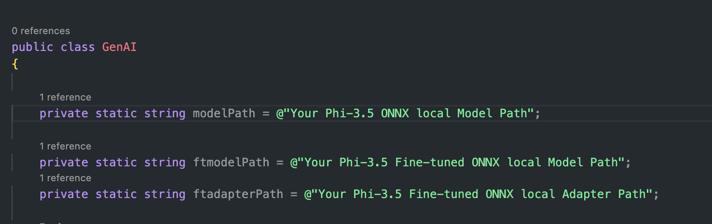
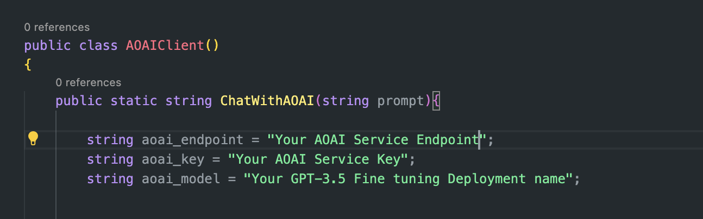
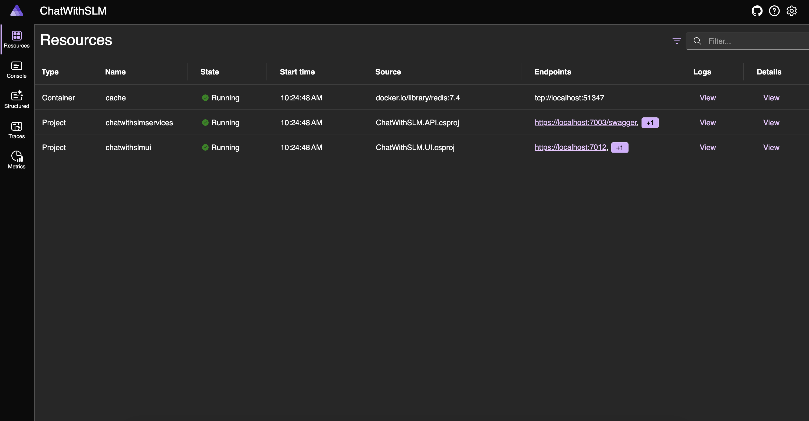
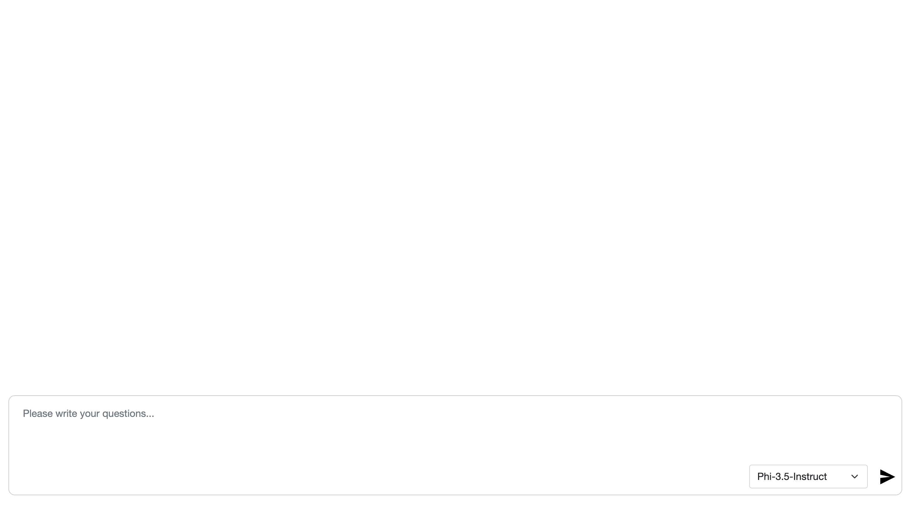
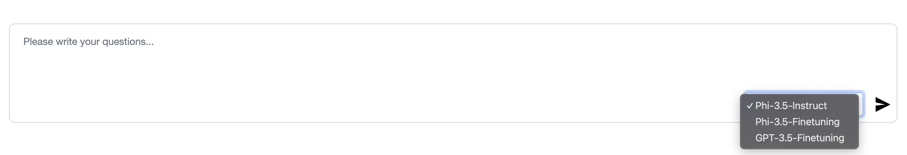

# Lab 7. Consumption of your Model within an Application 

## Introduction

> [!NOTE]
>This is a **10-minute** workshop that will give you a hands-on introduction to the core concepts of using a code first approach to consuming a deployed model endpoint.

## Learning Objectives

By the end of this workshop, you should be able to:
1. Integrate the custom fined Phi local model with the application.
1. Intergrate the custom fine tuned GPT Model with the applciation.
2. Compare the results of the models

## Lab Scenario
Use ONNX Runtime for On-device, Use Azure AI for Cloud.


## Setup 

Create a new folder on the desktop and clone the code using a command prompt.

Open a new Powershell terminal window
 
PS C:\Users\LabUser>

### Download the solution 

```
cd desktop
mkdir Application
cd application
git clone https://github.com/Azure/Ignite_FineTuning_workshop.git
```

### In the application folder navigate to the solution 

```
cd Ignite_FineTuning_workshop/lab/workshop-instructions/Lab7_Consumption_in_app/scr
ipts/ChatWithSLM
```
## Open the solution in VScode 

```
code
```

## Running fine-tuned GPT model in the cloud 

We will be using the previously created GPT-3.5 fined tuned model hosted in Azure AI
You will need to make a note of the following settings from +++https://ai.azure.com+++

The followng Endpoint, key and model name will be required in the next steps 

```
string aoai_endpoint = "Your AOAI Service Endpoint";        
string aoai_key = "Your AOAI Service Key";        
string aoai_model = "Your GPT-3.5 Fine tuning Deployment name";
```

## Running fine-tuned Phi local model application

In this exercise, you will:

- using ONNX Runtime GenAI to call fine-tuned model
- using .NET Aspire to create local Copilot Solution

### Objectives 

1. Running the Fine Tuned Phi-3.5 Onnx Local Model with a .NET Aspire Application
2. Running the Fine Tuned GPT-3.5 Model hosted in Azure AI Services 

### Additional Resources 
- Learn to set ONNX Runtime GenAI env [click here](../Additional_Labs/Local_Deployment_Model/readme.md)
-  Learn more about .NET Aspire env [click here](../Additional_Labs/dotNETAspire/readme.md)

## Add Your Fine Tuned GPT3.5 Model Path and Azure OpenAI Endpoint 

Go to '/scripts/ChatWithSLM/ChatWithSLM.API/Utils/GenAI.cs' , add ONNX Model Path

```
cd ./script/ChatWithSLM/ChatWithSLM.API/Utils/GenAI.cs

```




```
cd ./scripts/ChatWithSLM/ChatWithSLM.UI/Utils/AOAIClient.cs
```

### Update the following with the details 

```
string aoai_endpoint = "Your AOAI Service Endpoint";        
string aoai_key = "Your AOAI Service Key";        
string aoai_model = "Your GPT-3.5 Fine tuning Deployment name";
```




## Running Scripts

### Navigate to the Project Directory:

```
cd ./script/ChatWithSLM/ChatWithSLM.AppHost
```

### Build the Project:

```
dotnet dev-certs https --trust

dotnet run
```


### Accessing the .NET Aspire Portal
Click the Follow Link in the terminal to open the .NET Aspire Portal using the localhost link: 

Eample of the follow link in the info section of the output in your terminal 

```
Login to the dashboard at http://localhost:15147/login?t=65d752d2a8345d9f3t5656ef78e4777
```


### Go to the Portal:

Open up the brower windows and you will see the .NET Aspire Portal with a list of services and ports, select the chatwithslmui. You will see Endpoint as per the example below http://localhost:7012, click , you can go to the chat UI



ChatUI



You can run Phi-3.5-Instruct ONNX Model , Phi-3.5-Finetuning-travel ONNX model,and GPT-3.5-Finetuing model 



Testing different model Result about "Where in Rome should I stay?"


