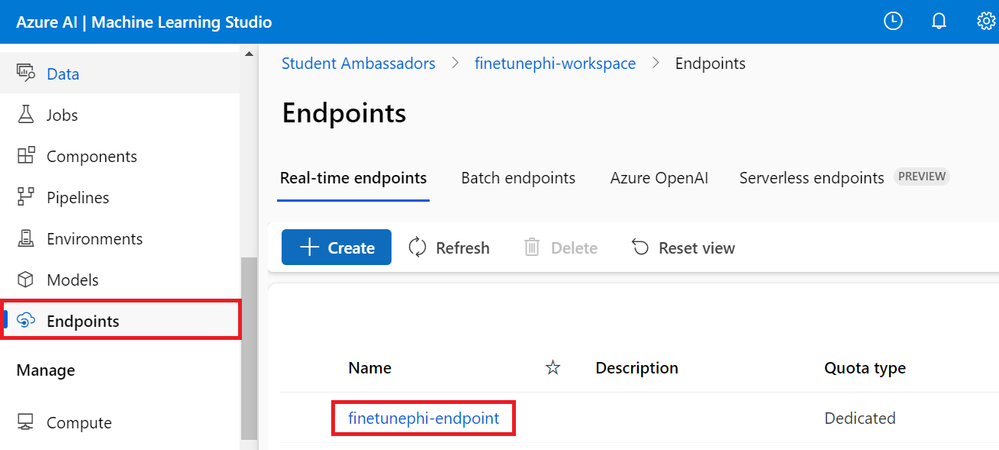

# Lab 7. Consumption of your Model within an Application 

## Introduction

> [!NOTE]
>This is a **10-minute** workshop that will give you a hands-on introduction to the core concepts of using a code first approach to consuming a deployed model endpoint.

## Learning Objectives

By the end of this workshop, you should be able to:
1. Integrate the custom Phi-3 model with Prompt flow.
1. Test your custom Phi-3 model on Prompt flow.

## Lab Scenario
This lab scenario comprimise of the following:    
- Integrate the custom Phi-3 model with Prompt flow
- Test your custom Phi-3 model on Prompt flow
- Set api key and endpoint uri of the fine-tuned Phi-3 model.
- Add code to the `flow.dag.yml` file.
- Add code to the `integrate_with_promptflow.py` file.
- Test your custom Phi-3 model on Prompt flow

## Lab Outline
This lab includes the following exercises:
1. Integrate the custom Phi-3 model with Prompt flow
1. Test your custom Phi-3 model on Prompt flow


### Exercise 1. Integrate the custom Phi-3 model with Prompt flow

After successfully deploying your fine-tuned model, you can now integrate it with Prompt Flow to use your model in real-time applications, enabling a variety of interactive tasks with your custom Phi-3 model.

In this exercise, you will:

- Set api key and endpoint uri of the fine-tuned Phi-3 model.
- Add code to the `flow.dag.yml` file.
- Add code to the `integrate_with_promptflow.py` file.
- Test your custom Phi-3 model on Prompt flow.
 

### Set api key and endpoint uri of the fine-tuned Phi-3 model

- Navigate to the Azure Machine learning workspace that you created.
-Select Endpoints from the left side tab.

-Select endpoint that you created.


- Select Consume from the navigation menu.

- Copy and paste your REST endpoint into the `config.py` file, replacing `AZURE_ML_ENDPOINT = "your_fine_tuned_model_endpoint_uri"` with your REST endpoint.

- Copy and paste your Primary key into the `config.py` file, replacing `AZURE_ML_API_KEY = "your_fine_tuned_model_api_key"` with your Primary key.

	

### Add code to the flow.dag.yml file

- Open the `flow.dag.yml` file in Visual Studio Code.

Add the following code into flow.`dag.yml`.

```Python
inputs:
  input_data:
    type: string
    default: "Who founded Microsoft?"

outputs:
  answer:
    type: string
    reference: ${integrate_with_promptflow.output}

nodes:
- name: integrate_with_promptflow
  type: python
  source:
    type: code
    path: integrate_with_promptflow.py
  inputs:
    input_data: ${inputs.input_data}
 
Add code to the integrate_with_promptflow.py file
```
 

- Open the `integrate_with_promptflow.py` file in Visual Studio Code.

Add the following code into `integrate_with_promptflow.py`.

```Python
import logging
import requests
from promptflow.core import tool
import asyncio
import platform
from config import (
    AZURE_ML_ENDPOINT,
    AZURE_ML_API_KEY
)

# Logging setup
logging.basicConfig(
    format="%(asctime)s - %(levelname)s - %(name)s - %(message)s",
    datefmt="%Y-%m-%d %H:%M:%S",
    level=logging.DEBUG
)
logger = logging.getLogger(__name__)

def query_azml_endpoint(input_data: list, endpoint_url: str, api_key: str) -> str:
    """
    Send a request to the Azure ML endpoint with the given input data.
    """
    headers = {
        "Content-Type": "application/json",
        "Authorization": f"Bearer {api_key}"
    }
    data = {
        "input_data": [input_data],
        "params": {
            "temperature": 0.7,
            "max_new_tokens": 128,
            "do_sample": True,
            "return_full_text": True
        }
    }
    try:
        response = requests.post(endpoint_url, json=data, headers=headers)
        response.raise_for_status()
        result = response.json()[0]
        logger.info("Successfully received response from Azure ML Endpoint.")
        return result
    except requests.exceptions.RequestException as e:
        logger.error(f"Error querying Azure ML Endpoint: {e}")
        raise

def setup_asyncio_policy():
    """
    Setup asyncio event loop policy for Windows.
    """
    if platform.system() == 'Windows':
        asyncio.set_event_loop_policy(asyncio.WindowsSelectorEventLoopPolicy())
        logger.info("Set Windows asyncio event loop policy.")

@tool
def my_python_tool(input_data: str) -> str:
    """
    Tool function to process input data and query the Azure ML endpoint.
    """
    setup_asyncio_policy()
    return query_azml_endpoint(input_data, AZURE_ML_ENDPOINT, AZURE_ML_API_KEY)
```
 

- Type the following command to run the integrate_with_promptflow script and start Prompt flow.

```Bash
pf flow serve --source ./ --port 8080 --host localhost
```

Here's an example of the results: Now you can chat with your custom Phi-3 model. It is recommended to ask questions based on the data used for fine-tuning.


