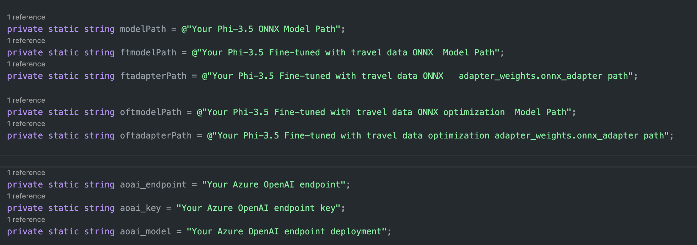
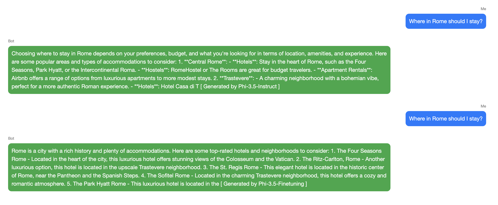

# Lab 7. Consumption of your Model within an Application 

## Introduction

> [!NOTE]
>This is a **10-minute** workshop that will give you a hands-on introduction to the core concepts of using a code first approach to consuming a deployed model endpoint. 

## Learning Objectives

By the end of this workshop, you should be able to:
1. Integrate the custom fined Phi local model with the application.
1. Intergrate the custom fine tuned GPT Model with the application.
2. Compare the results of the models

## Lab Scenario
In this lab you utilise a .NET console application or a Python Application to validate the following scenarios 

1. Chat with and evaliate resulting messages from various models:
- Phi-3.5 Mini Instruct ONNX Model from Hugging Face https://huggingface.co/microsoft/Phi-3.5-mini-instruct-onnx
- Phi-3.5 ONNX OLIVE Optimized fine tuned Model you created in Lab5
- GPT-.3.5 fine tuned Model your created in Lab3
3. Evaluation - this will allow you to compare the resulting messages, speed and quality.
4. Exit the application to complete this lab 

## Setup

### Connect to your Azure AI Compute

You'll connect to the Azure AI compute using the remote feature in VS Code. 

1. Open your **VS Code desktop application**:
1. Open the **command palette** using  **Shift+Ctrl+P**
1. In the command palette search for **AzureML - remote: Connect to compute instance in New Window**.
1. Follow the on-screen instructions to connect to the Compute. This will involve selecting your Azure Subscription, Resource Group, Project and Compute name you set up in Lab 1.

## Open a terminal in VSCode

```
cd Ignite_FineTuning_workshop/lab/workshop-instructions/Lab7_Consumption_in_app
```

## Option 1. Using Python application

> [!NOTE]
> You will be running the model on the **CPU** of the A100, *not* the GPU. This is to give you a flavour of the inference performance on a CPU device, which are more ubiquitous.

1. Open a **terminal** within your VScode A100 Session
1. Ensure you are running the `olive-ai` environment from Lab 5:
   ```bash
   conda activate olive-ai
   ```
1. Run the application using the base model:
   ```bash
   python app.py \
    -m ../Lab5-Optimize-Model/models/phi/onnx-ao/model \
    -g
   ```
1. Run the application using the base model + Fine-tuned Adapter:
   ```bash
   python app.py \
    -m ../Lab5-Optimize-Model/models/phi/onnx-ao/model \
    -a ../Lab5-Optimize-Model/models/phi/onnx-ao/model/adapter_weights.onnx_adapter \
    -g
   ```


## Option 2.Using the .NET application 

This application requires .NET to be installed on the A100 compute node

### Install .NET 8.

```
sudo apt-get update 
sudo apt-get install -y dotnet-sdk-8.0
```

### Edit your Model Locations in VSCode  

Naviagte to the folder 

In VSCode Solution explorer

```
/workshop-instructions/Lab7_Consumption_in_app/scripts/ChatSLM.Console
```

## Running fine-tuned GPT model in the cloud 

Open `ChatWithSLM.Console/Utils/GenAI.cs` in VSCode and add your onnx models path, and save the file.

You ONNX Path will be in the following format


> [!NOTE]
> For the Workshop Environment the we have provide copies of models in the `model`folder located on the desktop 

```
private static string modelPath = @"/home/azureuser/localfiles/Ignite_FineTuning_workshop/lab/workshop-instructions/Lab7_Consumption_in_app/Phi-3.5-mini-instruct-onnx/cpu_and_mobile/cpu-int4-awq-block-128-acc-level-4";    
 
private static string oftmodelPath = @"/home/azureuser/localfiles/Ignite_FineTuning_workshop/lab/workshop-instructions/Lab5-Optimize-Model/models/phi/onnx-ao/model";    

private static string oftadapterPath = @"/home/azureuser/localfiles/Ignite_FineTuning_workshop/lab/workshop-instructions/Lab5-Optimize-Model/models/phi/onnx-ao/model/adapter_weights.onnx_adapter";

```

The Azure Open AI Key can be found in deployments and select your deployed GPT-35 Fine Tuned Model +++https://ai.azure.com+++ open the playground select **view code** select curl and then **key authentication** to find the **Endpoint** and **API Key**

```
    Endpoint = "https://*******.openai.azure.com/";
    Key = "********";
    Model Name = "****";

``` 




## Running console application

1. Open a VSCode **Terminal** ensure your in '/workshop-instructions/Lab7_Consumption_in_app/scripts/ChatSLM.Console' folder
1. Run the following command to start the .NET application 

```
dotnet run
```

You can choose two different scenarios

1. Experience of different models based on travel data

2. Experience of models before and after optimization

As shown in the figure





### Downloading Additional ONNX Models from Hugging face 

Evaluate using other onnx model 

You can simply download other models to evaluate the output
```
git lfs install
git clone https://huggingface.co/<ModelID>
# Example git clone https://huggingface.co/microsoft/Phi-3.5-mini-instruct-onnx
```
